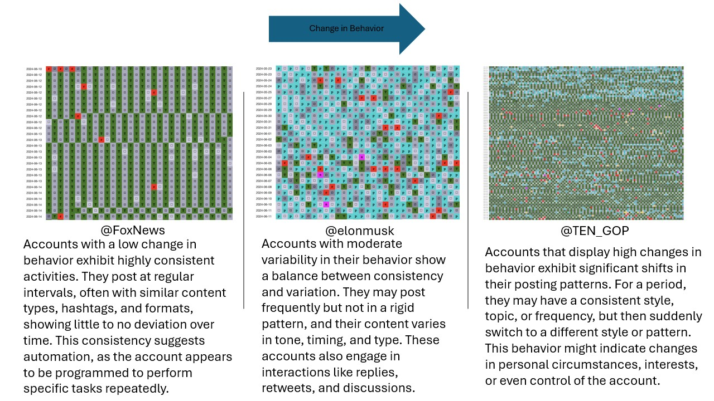
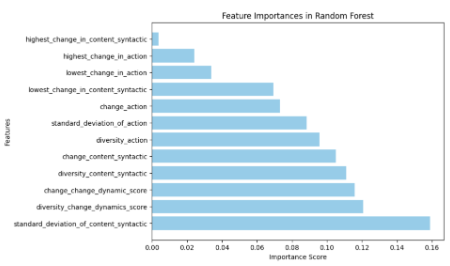
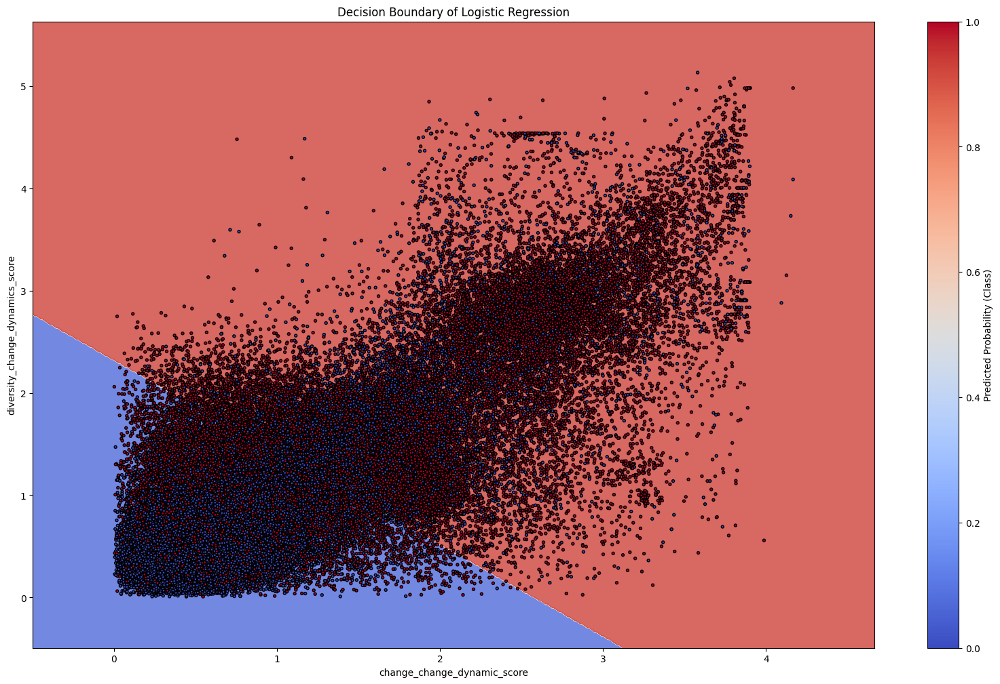
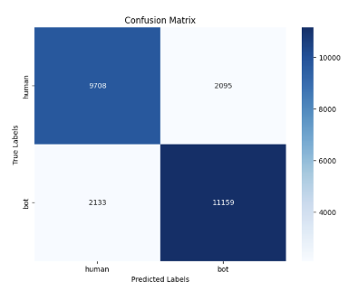

# Bloc_Change_Experiments

## Project Idea 
[Excalidraw.](https://excalidraw.com/#json=09XI-m-Om_-GWmV-J_2lh,GGIASaqsJp9ZX4LA-Ng7yA)
If the link is unavailable, open the local Excalidraw file [figures/final.excalidraw](figures/final.excalidraw)

## Project Resources

- [Final Notebook](ml_approaches/Final.ipynb)
- [Project Proposal](presentation/Project%20idea.pdf)
- [Final Presentation](presentation/Isuru_Ariyarathne_AML%20.pdf)

## Introduction
**Goal**: Demonstrate that measuring change and diversity are useful in identifying suspicious accounts.

**Suspicious account**: Accounts at extremes of change and diversity spectrum. In other words, accounts with very high change and diversity or very low change and diversity are the most suspicious.(Figure 1)

<figure style="text-align: center;">
  
  <figcaption><em>Figure 1: Twitter Accounts by <a href="https://newsresearch.lab.wm.edu/tools/agwagram?mode=examples">agwagram</a> tool</em></figcaption>
</figure>

Figure 1 and Figure 2, shows extremes have more bot-like behavior. These figures are generated using [ploting.ipynb](ml_approaches/ploting.ipynb)

  <figure style="text-align: center;">
    
    <figcaption><em>Figure 2.a: Action behavior indicating bot-like extremes.</em></figcaption>
  </figure>
  <figure style="text-align: center;">
    
    <figcaption><em>Figure 2.b: Content behavior illustrating diversity trends.</em></figcaption>
  </figure>

After normalizing(Figure 5 shows how to calculate the change dynamic score), we can get an idea of how we can classify accounts using change and diversity, considering both action and content.

<figure style="text-align: center;">
  
  <figcaption><em>Figure 3: Change dynamic score showing account classification potential.</em></figcaption>
</figure>

## Dataset

**Data**

For this study, we utilized a combination of datasets from the Bot Repository, which consists of labeled social media accounts collected and curated by various researchers between 2017 and 2019.
<figure style="text-align: center;">
  
  <figcaption><em>Figure 4: Overview of the data used for analysis.</em></figcaption>
</figure>

**Features**
To analyze user behavior, I began by generating action and content strings for each user. The change in these strings was calculated by segmenting the data based on pauses longer than one hour. Each segment was then converted into Term Frequency (TF) vectors, and the cosine similarity between each pair of segment vectors was computed. The change was determined using the formula Change = 1 - Cosine Similarity, quantifying the difference between segments. This process produced a list of changes for each user, from which I derived key features such as the highest change, lowest change, mean change, and standard deviation of changes. The mean value of the change list represents the overall change for the user.

To measure diversity, I analyzed the complete action and content strings without segmentation. These strings were transformed into Term Frequency (TF) vectors, and Shannon entropy was calculated to quantify the diversity of the vectors. This approach provided a single diversity score for each user's action and content strings.

Using the calculated change and diversity values, I developed dynamic scores to account for variations in both metrics. For change_dynamic_score_change and diversity_dynamic_score_diversity, I first computed the mean and standard deviation of the action and content string metrics. I then normalized these values and applied action and content weights to calculate the dynamic scores. The formulas for these scores are given in Figure 5

These scores, along with the features of change and diversity, form a comprehensive set of metrics to describe user behavior patterns.

<figure style="text-align: center;">
  
  <figcaption><em>Figure 5: Features for one user</em></figcaption>
</figure>

## Classification

**Model Accuracies**

<table>
  <tr>
    <th>Model</th>
    <th style="width: 100px;">Only Two Features</th>
    <th style="width: 100px;">Using All Features</th>
  </tr>
  <tr>
    <td>Random Forest</td>
    <td>0.6807</td>
    <td>0.8263</td>
  </tr>
  <tr>
    <td>Logistic Regression</td>
    <td>0.6807</td>
    <td>0.8263</td>
  </tr>
  <tr>
    <td>KNN</td>
    <td>0.6778</td>
    <td>0.8024</td>
  </tr>
  <tr>
    <td>XGBoost</td>
    <td>0.7192</td>
    <td>0.8299</td>
  </tr>
  <tr>
    <td>SVM - linear</td>
    <td>0.6840</td>
    <td>0.8016</td>
  </tr>
  <tr>
    <td>SVM - nonlinear</td>
    <td>0.7179</td>
    <td>0.8084</td>
  </tr>
</table>

**Randome Forest**

By analyzing the feature importance using Random Forest, it was observed that change_dynamic_score for change and diversity holds significant importance, as illustrated in Figure 6.
<figure style="text-align: center;">
  
  <figcaption><em>Figure 6: Feature importance</em></figcaption>
</figure>

## Logistic Regression - Results

**Decision Boundary**
<figure style="text-align: center;">
  
  <figcaption><em>Figure 7: Decision Boundary</em></figcaption>
</figure>

**Confusion Matrix**
<figure style="text-align: center;">
  
  <figcaption><em>Figure 8: Confusion Matrix</em></figcaption>
</figure>

## Chanllenges
One of the primary challenges encountered in this project was related to the change dynamics score. Some bot accounts exhibited low change_dynamic_scores for both change and diversity, leading to their misclassification as human accounts. This misclassification occurred because these specific accounts did not exhibit the extreme behaviors typically associated with suspicious accounts, making them harder to distinguish.

However, the overall goal of this project was to confidently identify accounts that display suspicious behavior. This means that the focus was on ensuring high confidence in the predictions for accounts classified as suspicious. While the misclassification of certain bot accounts as human might affect recall, it does not compromise the ability to confidently identify genuinely suspicious accounts. This balance ensures that the classification approach prioritizes precision, effectively flagging accounts with clearly anomalous behaviors.

## Discussion
Through this project, I demonstrated that accounts exhibiting heterogeneous behaviors, characterized by extreme levels of change and diversity, can be effectively classified as suspicious. By calculating change and diversity scores for both action and content strings, and normalizing these metrics to create dynamic scores, it became possible to identify patterns that are indicative of bot-like or unusual activity.

The models tested in this study, including Random Forest, Logistic Regression, and XGBoost, showcased the utility of these features in classification tasks. Among them, Random Forest highlighted the significance of the change_dynamic_score and diversity_dynamic_score, confirming their relevance in distinguishing suspicious accounts. The highest performance was achieved when using all features, with XGBoost attaining an accuracy of 82.99%, illustrating that incorporating a variety of behavioral metrics strengthens the classification process.

Visualizations, such as decision boundaries and feature importance analyses, further supported the hypothesis that extreme behaviors on the spectrum of change and diversity are strongly associated with suspicious activity. This approach provides a novel perspective on identifying such accounts, leveraging both action and content-based behavior analysis.

By integrating change and diversity measurements with machine learning techniques, this project contributes to advancing the detection of suspicious online accounts, providing a foundation for further exploration in identifying and mitigating harmful activities on social media platforms.

## Acknowledgment

- [BLOC Framework](https://github.com/anwala/bloc)
- [BLOC Change Experiments](https://github.com/anwala/bloc-change-experiments)

